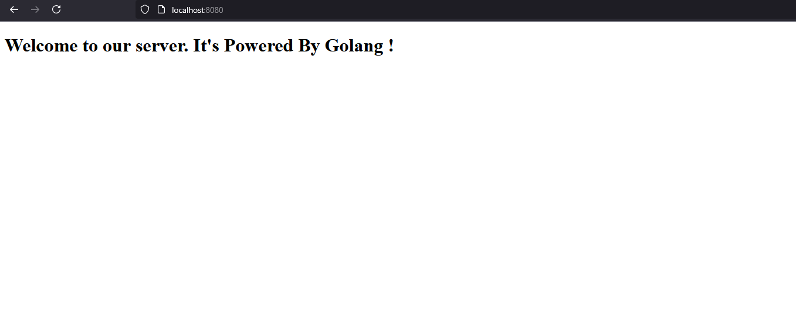

# GoWebServer

A lightweight, efficient static web server written in Go. This server is designed to serve static web pages effortlessly, making it ideal for quickly hosting and testing your web projects.


## Features

- **Simple to Set Up:** No complex configurations required—just run the server and get your static site up and running.
- **Efficient and Fast:** Golang's powerful networking and performance optimizations.
- **Minimalistic Design:** Focus on serving static assets without additional complexity.

## Getting Started

### Prerequisites

Ensure you have Go installed on your system. You can download it [here](https://golang.org/dl/).

### Installation

Clone the repository to your local machine:

```bash
git clone https://github.com/CodeWithTamim/GoWebServer.git
cd GoWebServer
```

### Running the Server

To run the server, simply execute:

```bash
go run main.go
```

By default, the server will start on `localhost:8080`. You can then access your static files by navigating to `http://localhost:8080` in your browser.

### Customizing Port

If you want to run the server on a different port, modify the `main.go` file as follows:

```go
http.ListenAndServe(":YOUR_PORT", nil)
```

## License

This project is licensed under the Apache 2.0 License. See the [LICENSE](./LICENSE) file for details.

